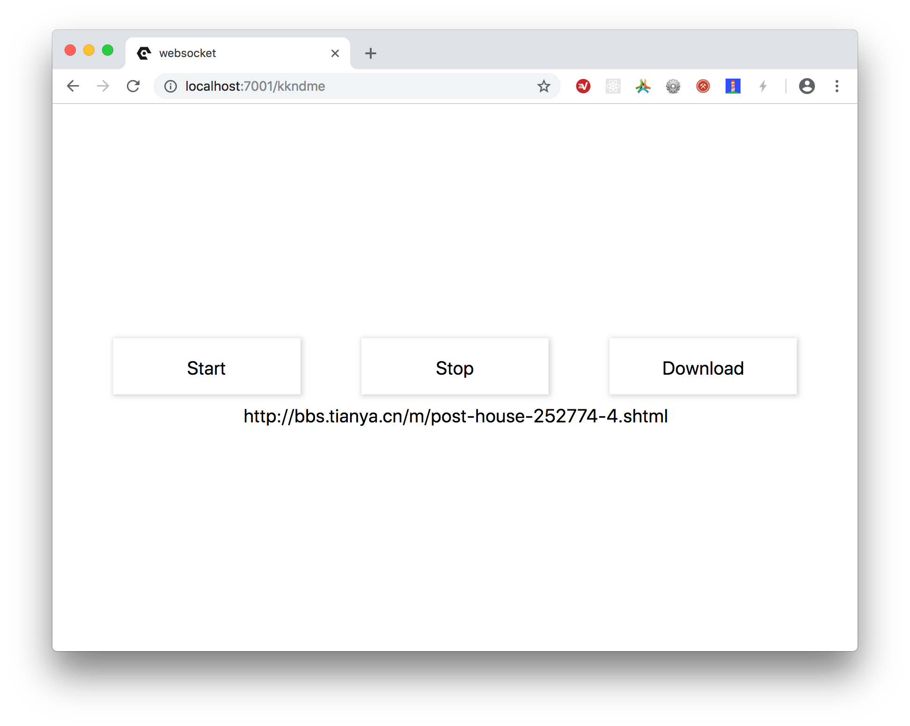

# Spider
This is a demo, which used `Puppeteer`、`Websocket` and `Egg`.<br>
* [Puppeteer](https://github.com/GoogleChrome/puppeteer)
* [Socket.io](https://socket.io/get-started/chat/#The-web-framework)
* [Egg Socket](https://eggjs.org/en/tutorials/socketio.html)
* [Egg Socket Demo](https://github.com/eggjs/egg-socket.io)





## QuickStart

<!-- add docs here for user -->

see [egg docs][egg] for more detail.

### Development

```bash
$ npm i
$ npm run dev
$ open http://localhost:7001/
```

### Deploy

```bash
$ npm start
$ npm stop
```

### npm scripts

- Use `npm run lint` to check code style.
- Use `npm test` to run unit test.
- Use `npm run autod` to auto detect dependencies upgrade, see [autod](https://www.npmjs.com/package/autod) for more detail.


[egg]: https://eggjs.org